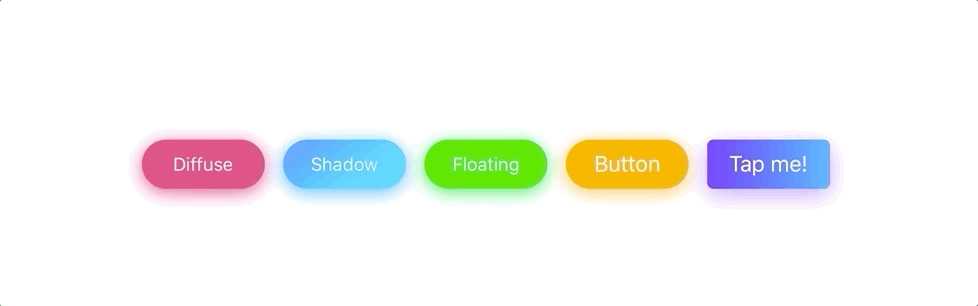
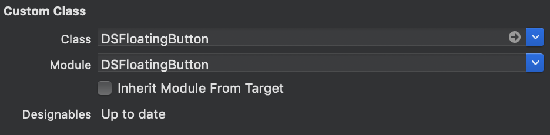
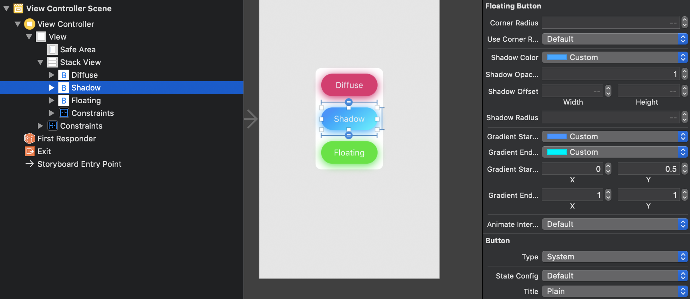

# DSFloatingButton
[](https://github.com/trueSuperior/DSFloatingButton)
[](https://travis-ci.org/trueSuperior/DSFloatingButton)
[](https://cocoapods.org/pods/DSFloatingButton)
[](https://cocoapods.org/pods/DSFloatingButton)
[](https://cocoapods.org/pods/DSFloatingButton)

Easy to create diffuse shadow effect buttons.


## Installation
### CocoaPods
```ruby
pod 'DSFloatingButton'
```

### Charthage
```
github "trueSuperior/DSFloatingButton"
```

### Manual

Add DSFloatingButotn.swift to your project.

## Usage
### Interface Builder

Simply add a UIButton, and in the Identity Inspector change the class and module to DSFloatingButton.


You can change the appearance in the Interface Builder.

### Programmatically
```swift
// Easy to create programmatically.
let button = DSFloatingButton(frame: CGRect(x: 0, y: 0, width: 100, height: 40))
button.backgroundColor = #colorLiteral(red: 1, green: 0.645, blue: 0, alpha: 1)
button.setTitle("Button", for: [])
stackView.addArrangedSubview(button)

// If you want to know more detail see example.
```

## Author

UMA, trueSuperiorDev@gmail.com

## License

DSFloatingButton is available under the MIT license. See the LICENSE file for more info.
